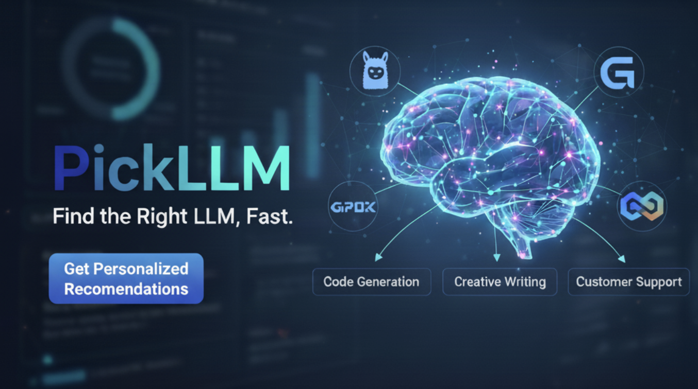

# 🤖 PickLLM

> Find the perfect AI model for any task



## 📝 What is PickLLM?

PickLLM helps users find the right large language model (LLM) for their specific use case. Instead of drowning in technical benchmarks and scattered metrics, PickLLM provides actionable recommendations tailored to your needs.

### 🎯 Why PickLLM?

**The Problem:**

- 🤯 Too many LLMs with varying size, cost, latency, and licensing
- 📊 Technical evaluation metrics that are scattered and hard to interpret
- ⚖️ Users must switch between different leaderboards when facing trade-offs among cost, latency, and intelligence
- 🔍 Users need actionable recommendations, not raw benchmark scores

**Our Solution:**

- 📝 Simple questionnaire to understand your use case
- 🧠 Smart recommendation engine powered by LLM database
- 🏆 Top 3 LLM recommendations with clear reasoning
- ⚖️ Compare models side-by-side to make the best choice

## 🚀 How It Works

```text
Landing Page → Questionnaire → Backend Analysis → Results → Your Perfect LLM
```

1. **Welcome** - Start with our friendly landing page
2. **Questionnaire** - Answer questions about your use case (multiple choice + optional description)
3. **Analysis** - Our backend queries the LLM database with your requirements
4. **Recommendations** - Get top 3 LLM suggestions with detailed reasoning
5. **Compare & Choose** - Review options and select your perfect match

## 🛠️ Tech Stack

- **Backend:** Python, PostgreSQL/MongoDB
- **LLM Integration:** OpenAI API, LangChain
- **Recommendation Engine:** Rule-based + ML algorithms
- **Development:** Cursor, Claude Code
- **Version Control:** GitHub
- **Deployment:** Vercel, AWS/GCP/Azure

## ⚡ Quick Start

### Prerequisites

- Python 3.8+
- Node.js 16+
- PostgreSQL or MongoDB

### Installation

```bash
# Clone the repository
git clone https://github.com/your-username/PickLLM.git
cd PickLLM

# Install backend dependencies
pip install -r requirements.txt

# Install frontend dependencies (when available)
npm install

# Set up environment variables
cp .env.example .env
# Edit .env with your API keys and database credentials
```

### Running the Application

```bash
# Start the backend server
python app.py

# Start the frontend (when available)
npm run dev

# Open your browser to http://localhost:3000
```

## 🎯 Features

- 📋 **Smart Questionnaire** - Intuitive questions to understand your needs
- 🔍 **LLM Database** - Comprehensive database of models with metrics
- 🏆 **Top 3 Recommendations** - Curated suggestions with reasoning
- ⚖️ **Side-by-Side Comparison** - Compare models on key metrics
- 💡 **Actionable Insights** - Clear explanations, not just numbers
- 🚀 **Fast & Simple** - Get recommendations in minutes, not hours

## 🤝 Contributing

We welcome contributions! Please see our [Contributing Guide](CONTRIBUTING.md) for details.

1. Fork the repository
2. Create your feature branch (`git checkout -b feature/amazing-feature`)
3. Commit your changes (`git commit -m 'Add amazing feature'`)
4. Push to the branch (`git push origin feature/amazing-feature`)
5. Open a Pull Request

## 📄 License

This project is licensed under the MIT License - see the [LICENSE](LICENSE) file for details.

## 🗺️ Roadmap

- [ ] **Phase 1:** Core questionnaire and recommendation engine
- [ ] **Phase 2:** Advanced filtering and comparison features
- [ ] **Phase 3:** User accounts and saved recommendations
- [ ] **Phase 4:** API access for developers
- [ ] **Phase 5:** Mobile app