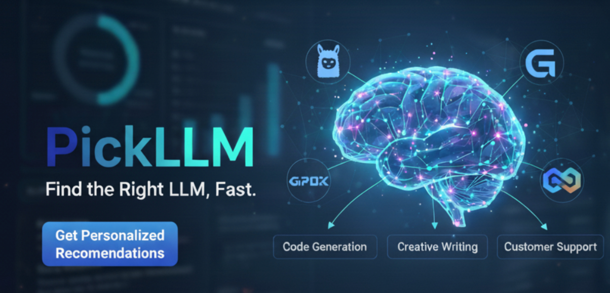

<<<<<<< HEAD
Check out the configuration reference at https://huggingface.co/docs/hub/spaces-config-reference
=======


## 📝 What is PickLLM?

PickLLM helps users find the right large language model (LLM) for their specific use case. Instead of drowning in technical benchmarks and scattered metrics, PickLLM provides actionable recommendations tailored to your needs.

### 🎯 Why PickLLM?

**The Problem:**

- 🤯 Too many LLMs with varying size, cost, latency, and licensing
- 📊 Technical evaluation metrics that are scattered and hard to interpret
- ⚖️ Users must switch between different leaderboards when facing trade-offs among cost, latency, and intelligence
- 🔍 Users need actionable recommendations, not raw benchmark scores

**Our Solution:**

- 📝 Simple questionnaire to understand your use case
- 🧠 Smart recommendation engine powered by LLM database
- 🏆 Top 3 LLM recommendations with clear reasoning
- ⚖️ Compare models side-by-side to make the best choice

## 🚀 How It Works

```text
Landing Page → Questionnaire → Backend Analysis → Results → Your Perfect LLM
```

1. **Welcome** - Start with our friendly landing page
2. **Questionnaire** - Answer questions about your use case (multiple choice + optional description)
3. **Analysis** - Our backend queries the LLM database with your requirements
4. **Recommendations** - Get top 3 LLM suggestions with detailed reasoning
5. **Compare & Choose** - Review options and select your perfect match

## 🛠️ Tech Stack

- **Backend:** Flask (Python)
- **Frontend:** Jinja2 Templates + Bootstrap 5
- **Styling:** Custom CSS + Bootstrap
- **Package Management:** uv
- **Deployment:** Vercel, AWS/GCP/Azure

## ⚡ Quick Start

### Prerequisites

- Python 3.8+
- uv (for dependency management)

### Installation

```bash
# Clone the repository
git clone https://github.com/your-username/PickLLM.git
cd PickLLM

# Install dependencies with uv
uv add flask python-dotenv

# Set up environment variables (optional)
cp .env.example .env
# Edit .env with your configuration if needed
```

### Running the Application

```bash
# Start the Flask development server
uv run python app.py

# Open your browser to http://localhost:5555
```

### Data Collection

```bash
# Collect the latest LLM leaderboard data
python collect_leaderboard_data.py

# This will create CSV files in the data/ directory with current rankings
```

## 📊 Data

PickLLM's recommendations are powered by real-time data from the **LMArena Leaderboard**, one of the most comprehensive and trusted sources for LLM performance evaluation.

### 🏟️ LMArena Dataset

Source: [LMArena Leaderboard](https://huggingface.co/spaces/lmarena-ai/lmarena-leaderboard) by LMSYS

**What is LMArena?**
LMArena is a crowdsourced platform where users compare LLM responses side-by-side in real conversations. Unlike synthetic benchmarks, LMArena captures real-world performance through human preference data.

**Data Dimensions:**
- 📝 Text - General conversation and text generation (258+ models)
- 👁️ Vision - Multimodal visual understanding (87+ models)
- 🖼️ Image - Image generation and editing (18+ models)
- ✏️ Image-Edit - Advanced image manipulation capabilities
- 🌐 WebDev - Web development and coding assistance

**Key Metrics:**
- Arena Score - Elo rating from head-to-head comparisons
- Confidence Intervals - Statistical reliability of rankings
- Vote Count - Number of human evaluations
- Model Metadata - Organization, license, knowledge cutoff

**Why LMArena?**
1. Human-Centric - Based on real user preferences, not synthetic tests
2. Comprehensive - Covers multiple modalities and use cases
3. Transparent - Open methodology and continuous updates
4. Battle-Tested - Millions of comparisons from diverse users worldwide

This rich, real-world dataset enables PickLLM to provide recommendations that truly reflect how models perform in practice, not just in laboratory conditions.

## 🧠 Recommendation Algorithm

PickLLM uses a smart questionnaire-based approach to understand your specific needs and match them with the most suitable LLMs from our comprehensive database. Here's how our recommendation engine works:

### 📋 Questionnaire Structure

Our questionnaire consists of 8 core questions plus an optional description field, designed to capture the key factors that influence LLM selection:

**1. Primary Use Case**
- Conversational & Knowledge Agents
- Productivity & Information Handling
- Creative & Content Generation
- Technical & Developer Tools
- Advanced Automation
- Visual AI

➡️ If the user selects “Visual AI” show:

**2. What type of Visual AI do you need?**
- Image Understanding (describe/analyze inputs)
- Image Generation (create from text prompts)
- Image Editing (modify existing images)

**3. Model Type Preference**
- Open weights only (self-hostable)
- Proprietary only with enterprise SLA
- No preference

**4. Response Speed Requirements**
- Real-time streaming
- Fast (1–2s)
- Moderate (2–5s)
- Not critical (>5s fine)

**5. Budget Priority**
- Minimize cost
- Best value (cost/quality balance)
- Premium quality even if expensive
- Not sure

**6. Estimated Monthly Budget**
- <$50
- $50–$200
- $200–$1k
- $1k–$10k
- $10k+
- Not sure

**7. Context Length Required**
- Short (≤8k tokens)
- Medium (8k–32k)
- Long (32k–128k)
- Huge (≥128k)

**8. Additional Details (Optional)**
- Free-text field for specific requirements, constraints, or use case details

### 🎯 Recommendation Logic

Our algorithm processes your questionnaire responses through several stages:

1. **Use Case Mapping** - Maps your primary use case to relevant LMArena categories (text, vision, image, etc.)
2. **Capability Filtering** - Filters models based on must-have requirements (vision, image generation, model type)
3. **Performance Scoring** - Weighs models based on arena scores and your specific use case requirements
4. **Budget Optimization** - Considers cost-effectiveness within your budget constraints
5. **Speed Matching** - Factors in latency requirements and model inference speeds
6. **Context Length Validation** - Ensures selected models support your context length needs
7. **Final Ranking** - Produces top 3 recommendations with detailed reasoning

The result is a personalized selection of LLMs that best match your specific requirements, complete with explanations of why each model was chosen and how it addresses your needs.

## 🎯 Features

- 📋 **Smart Questionnaire** - Intuitive questions to understand your needs
- 🔍 **LLM Database** - Comprehensive database of models with metrics
- 🏆 **Top 3 Recommendations** - Curated suggestions with reasoning
- ⚖️ **Side-by-Side Comparison** - Compare models on key metrics
- 💡 **Actionable Insights** - Clear explanations, not just numbers
- 🚀 **Fast & Simple** - Get recommendations in minutes, not hours
- 🎯 **No Signup Required** - Jump straight to finding your perfect LLM

## 🤝 Contributing

We welcome contributions! Please see our [Contributing Guide](CONTRIBUTING.md) for details.

1. Fork the repository
2. Create your feature branch (`git checkout -b feature/amazing-feature`)
3. Commit your changes (`git commit -m 'Add amazing feature'`)
4. Push to the branch (`git push origin feature/amazing-feature`)
5. Open a Pull Request

## 📄 License

This project is licensed under the MIT License - see the [LICENSE](LICENSE) file for details.

## 🗺️ Roadmap

- [x] **Phase 1:** Core questionnaire and recommendation engine
- [ ] **Phase 2:** Advanced filtering and comparison features
- [ ] **Phase 3:** LLM database integration with real-time data
- [ ] **Phase 4:** API access for developers
<<<<<<< HEAD
- [ ] **Phase 5:** Mobile app
>>>>>>> 033a037 (initial commit)
=======
- [ ] **Phase 5:** Mobile app and advanced analytics
>>>>>>> 933673b (added POC)
